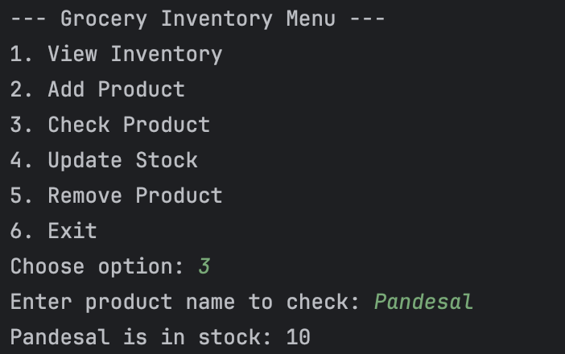

# Lab 1: Part 1 of 2 Grocery Store Inventory System

### Name: Jerome Yang
## 1. View Inventory

## 2. Add Product

## 3. Check Product

## 4. Update Stock

## 5. Remove Product

## 6. Exit 

## 7. Unit Test Output

